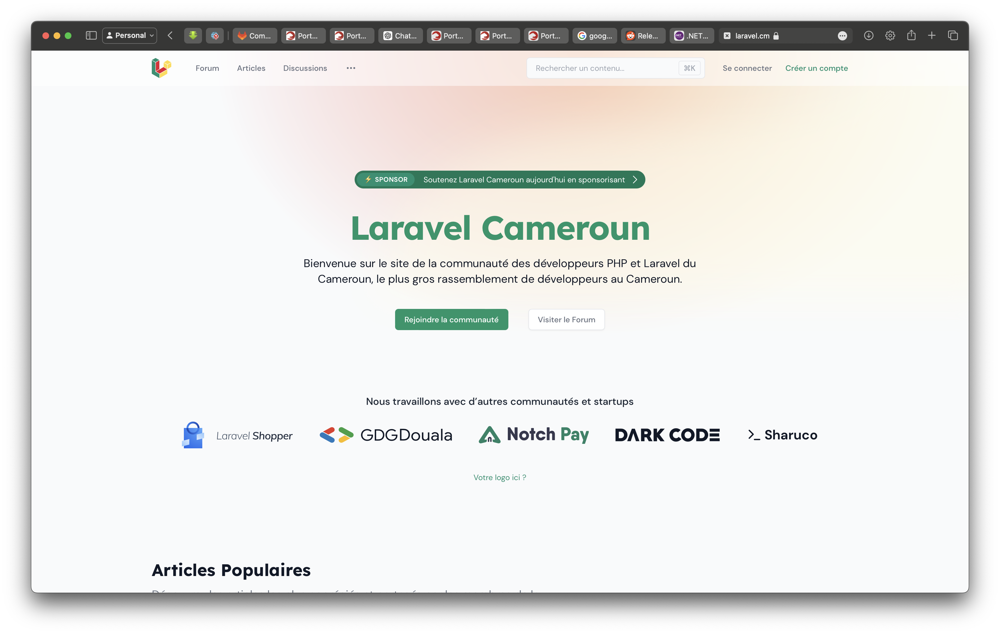

# Home page

The home page is responsible for keeping the visitor interested about the community. It will contain several sections that we will break down as follows.

## Hero Section




Here are two templates we will take inspiration from.
The content on this section could look like:

```md
# Headline:

"Empowering .NET Developers in Cameroon"

# Subtitle:

"Join our community to connect, learn, and grow with fellow .NET enthusiasts. Stay updated with the latest events, resources, and news."

# Action links

- Join us
- Learn more
```

## What we do

Specify the various activities we do in the community as cards.

- live codings
- conference and meetups
- open source projects

## About

Contains the description of the community as well as some statistics

- total members (Discord, WhatsApp, Telegram)
- total followers (LinkedIn, Twitter)
- total events
- total projects

Right after that, we have an `Action link to become a member`

## Our partners

Just a list of companies logos. Logos are eventually links that redirects to the company website if known.

`View all partners` if the list is more than 5 companies. In that case, a quick page will be developed to showcase the entire list of our partners.

## Latest blog posts

If there are
